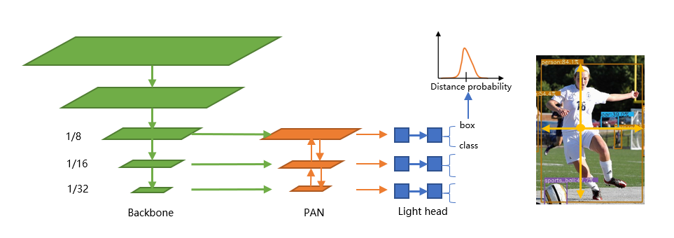
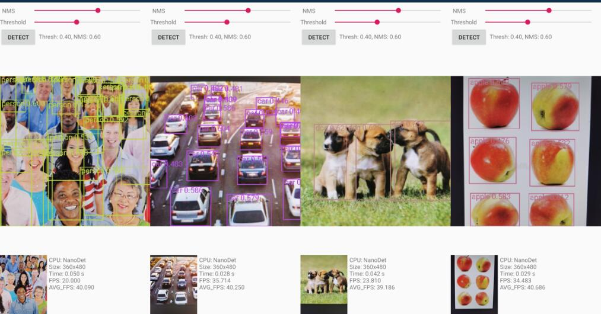

# NanoDet


### Super fast and lightweight anchor-free object detection model. Real-time on mobile devices.

* ⚡Super lightweight: Model file is only 1.8 mb.
* ⚡Super fast: 97fps(10.23ms) on mobile ARM CPU.
* 😎Training friendly:  Much lower GPU memory cost than other models. Batch-size=80 is available on GTX1060 6G.
* 😎Easy to deploy: Provide **C++ implementation** and **Android demo** based on ncnn inference framework.

****

## Benchmarks

Model     |Resolution|COCO mAP|Latency(ARM 4xCore)|FLOPS|Params   | Model Size(ncnn bin)
:--------:|:--------:|:------:|:-----------------:|:---:|:-------:|:-------:
NanoDet-m | 320*320 |  20.6 | 10.23ms | 0.72B   | 0.95M | 1.8mb
NanoDet-m | 416*416 |  21.7 | 16.44ms | 1.2B    | 0.95M | 1.8mb
YoloV3-Tiny| 416*416 | 16.6 | 37.6ms  | 5.62B   | 8.86M | 33.7mb
YoloV4-Tiny| 416*416 | 21.7 | 32.81ms | 6.96B   | 6.06M | 23.0mb

Note:

* Performance is measured on Kirin 980(4xA76+4xA55) ARM CPU based on ncnn.

* NanoDet mAP(0.5:0.95) is validated on COCO val2017 dataset with no testing time augmentation. 

* YOLO mAP refers from [Scaled-YOLOv4: Scaling Cross Stage Partial Network](https://arxiv.org/abs/2011.08036)

****
NanoDet is a FCOS-style one-stage anchor-free object detection model which using ATSS for target sampling and using Generalized Focal Loss for classification and box regression. Please refer to these papers for more detail.

[Fcos: Fully convolutional one-stage object detection](http://openaccess.thecvf.com/content_ICCV_2019/papers/Tian_FCOS_Fully_Convolutional_One-Stage_Object_Detection_ICCV_2019_paper.pdf)

[ATSS:Bridging the Gap Between Anchor-based and Anchor-free Detection via Adaptive Training Sample Selection](https://arxiv.org/pdf/1912.02424.pdf)

[Generalized Focal Loss: Learning Qualified and Distributed Bounding Boxes for Dense Object Detection](https://arxiv.org/pdf/2006.04388.pdf)




[知乎中文介绍](https://zhuanlan.zhihu.com/p/306530300)
 | QQ交流群：908606542 (答案：炼丹)

****
## Demo

### Android demo



Android demo project is in ***demo_android_ncnn*** folder. Please refer to [Android demo guide](demo_android_ncnn/README.md).

### C++ demo

C++ demo based on ncnn is in ***demo_ncnn*** folder. Please refer to [Cpp demo guide](demo_ncnn/README.md).

### Python demo

First, install requirements and setup NanoDet following installation guide. Then download COCO pretrain weight from here👉[COCO pretrain weight(Google Drive)](https://drive.google.com/file/d/1EhMqGozKfqEfw8y9ftbi1jhYu86XoW62/view?usp=sharing).

* Inference images

```bash
python demo/demo.py image --config CONFIG_PATH --model MODEL_PATH --path IMAGE_PATH
```

* Inference video

```bash
python demo/demo.py video --config CONFIG_PATH --model MODEL_PATH --path VIDEO_PATH
```

* Inference webcam

```bash
python demo/demo.py webcam --config CONFIG_PATH --model MODEL_PATH --camid YOUR_CAMERA_ID
```

****

## Install

### Requirements

* Linux or MacOS
* CUDA >= 10.0
* Python >= 3.6
* Pytorch >= 1.3
* experimental support Windows (Notice: Windows not support distributed training before pytorch1.7)

### Step

1. Create a conda virtual environment and then activate it.

```shell script
 conda create -n nanodet python=3.8 -y
 conda activate nanodet
```

2. Install pytorch

```shell script
conda install pytorch torchvision cudatoolkit=11.0 -c pytorch
```

3. Install requirements

```shell script
pip install Cython termcolor numpy tensorboard pycocotools matplotlib pyaml opencv-python tqdm
```

4. Setup NanoDet

```shell script
git clone https://github.com/RangiLyu/nanodet.git
cd nanodet
python setup.py develop
```

****

## How to Train

1. **Prepare dataset**

    Convert your dataset annotations to MS COCO format[(COCO annotation format details)](https://cocodataset.org/#format-data). 

    If your dataset annotations are pascal voc xml format, using this repo to convert data. 👉 [voc2coco](https://github.com/yukkyo/voc2coco)

2. **Prepare config file**

    Copy and modify an example yml config file in config/ folder.

    Change ***save_path*** to where you want to save model.

    Change ***num_classes*** in ***model->arch->head***.

    Change image path and annotation path in both ***data->train   data->val***.

    Set gpu, workers and batch size in ***device*** to fit your device.

    Set ***total_epochs***, ***lr*** and ***lr_schedule*** according to your dataset and batchsize.

    If you want to modify network, data augmentation or other things, please refer to [Config File Detail](docs/config_file_detail.md)

3. **Start training**

    For single GPU, run

    ```shell script
    python tools/train.py CONFIG_PATH
    ```

    For multi-GPU, NanoDet using distributed training. (Notice: Windows not support distributed training before pytorch1.7) Please run

    ```shell script
    python -m torch.distributed.launch --nproc_per_node=GPU_NUM --master_port 29501 tools/train.py CONFIG_PATH
    ```

****

## How to Deploy

NanoDet provide C++ and Android demo based on ncnn library.

1. Convert model

    To convert NanoDet pytorch model to ncnn, you can choose this way: pytorch->onnx->ncnn

    To export onnx model, run tools/export.py. Then using [onnx-simplifier](https://github.com/daquexian/onnx-simplifier) to simplify onnx structure.

    Run **onnx2ncnn** in ncnn tools to generate ncnn .param and .bin file. 
    
    After that, using **ncnnoptimize** to optimize ncnn model.

    If you have quentions about converting ncnn model, refer to ncnn wiki. https://github.com/Tencent/ncnn/wiki 

2. Run NanoDet model with C++

    Please refer to [demo_ncnn](demo_ncnn/README.md).

3. Run NanoDet on Android

    Please refer to [android_demo](demo_android_ncnn/README.md).

****

## Thanks

https://github.com/Tencent/ncnn

https://github.com/open-mmlab/mmdetection

https://github.com/implus/GFocal

https://github.com/cmdbug/YOLOv5_NCNN

https://github.com/rbgirshick/yacs


